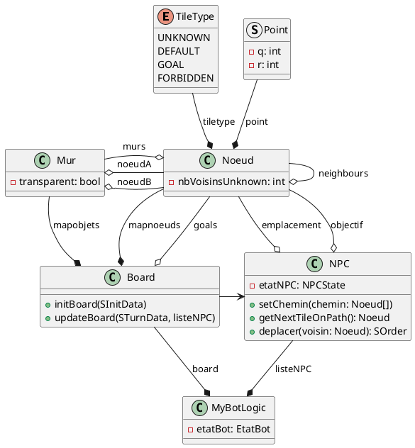
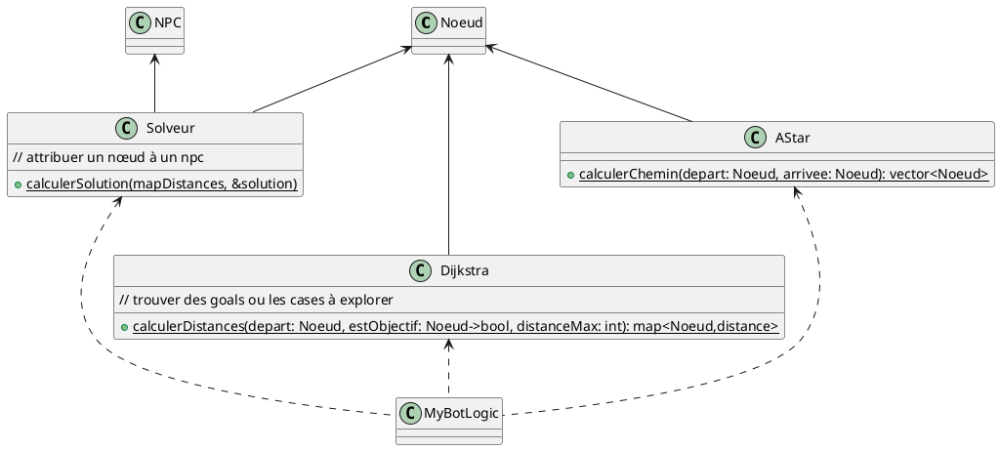

```plantuml
@startuml

enum TileType {
    UNKNOWN
    DEFAULT
    GOAL
    FORBIDDEN
}

struct Point {
    -q: int
    -r: int
}

class Noeud {
    -nbVoisinsUnknown: int
}
class Mur {
    -transparent: bool
}
class Board {
    +initBoard(SInitData)
    +updateBoard(STurnData, listeNPC)
}
class NPC {
    -etatNPC: NPCState
    +setChemin(chemin: Noeud[])
    +getNextTileOnPath(): Noeud
    +deplacer(voisin: Noeud): SOrder
}
class MyBotLogic {
    -etatBot: EtatBot
}

Noeud -o Noeud : "neighbours"
Point --* Noeud : "point"
TileType --* Noeud : "tiletype"

Mur --o Noeud : "murs"
Mur o- Noeud : "noeudA"
Mur o- Noeud : "noeudB"

Mur --* Board : "mapobjets"
Noeud --* Board : "mapnoeuds"
Noeud --o Board : "goals"

Board -> NPC

Noeud --o NPC : emplacement
Noeud --o NPC : objectif

Board --* MyBotLogic : board
NPC --* MyBotLogic : listeNPC

@enduml
```

```plantuml
@startuml

class Noeud {
}
class Solveur {
    // attribuer un nœud à un npc
    {static} +calculerSolution(mapDistances, &solution)
}
class Dijkstra {
    // trouver des goals ou les cases à explorer
    {static} +calculerDistances(depart: Noeud, estObjectif: Noeud->bool, distanceMax: int): map<Noeud,distance>
}
class AStar {
    {static} +calculerChemin(depart: Noeud, arrivee: Noeud): vector<Noeud>
}
class NPC

Noeud <-- Solveur
NPC <-- Solveur

Noeud <-- AStar

Noeud <-- Dijkstra

Dijkstra <.. MyBotLogic
AStar <... MyBotLogic
Solveur <... MyBotLogic

@enduml
```
